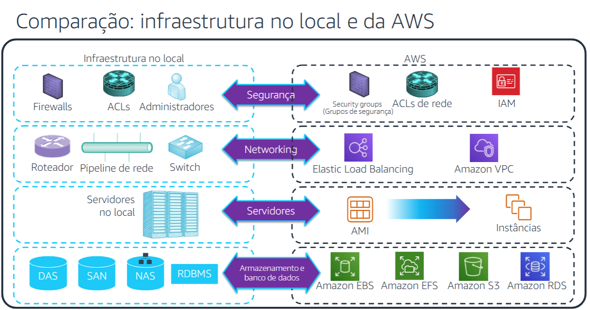
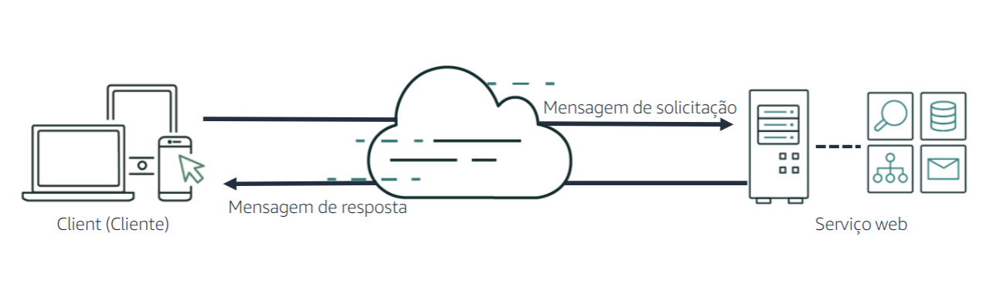
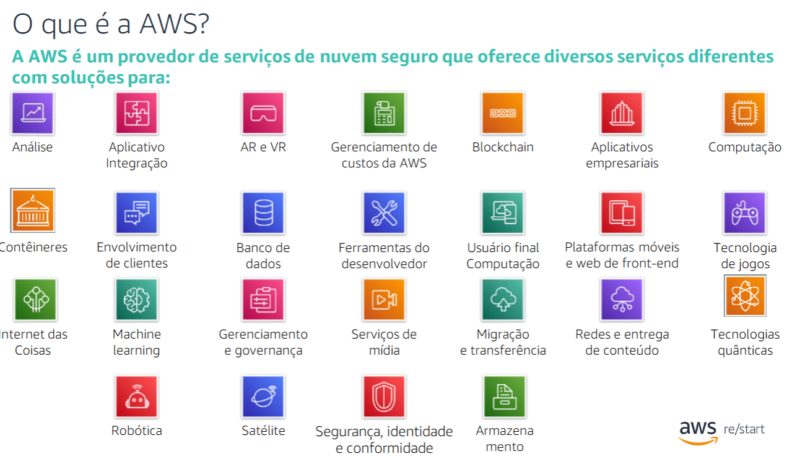
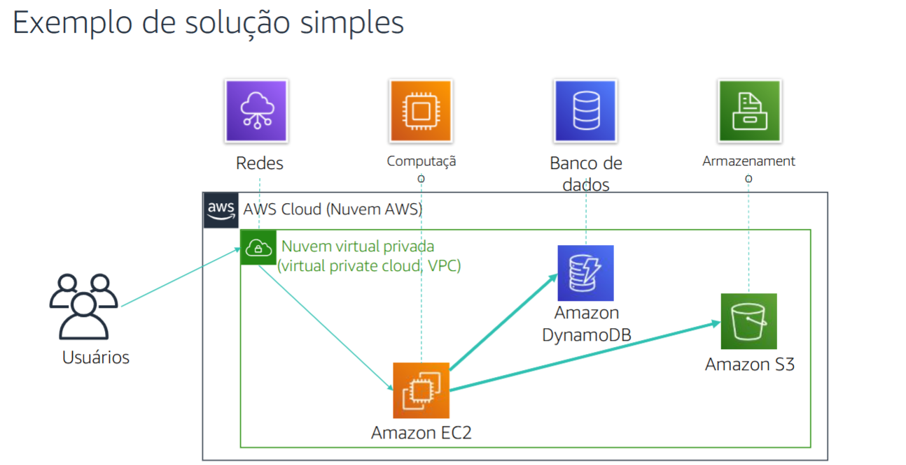
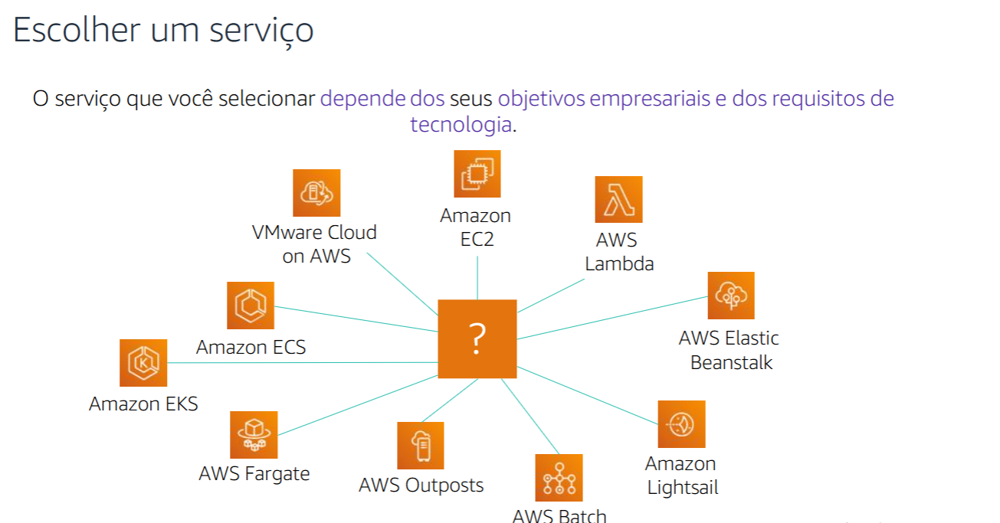
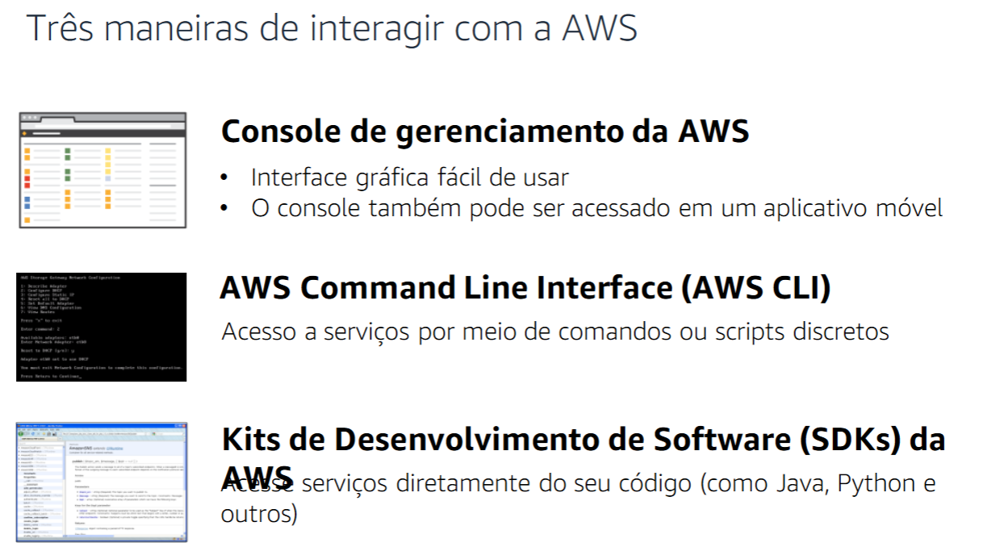
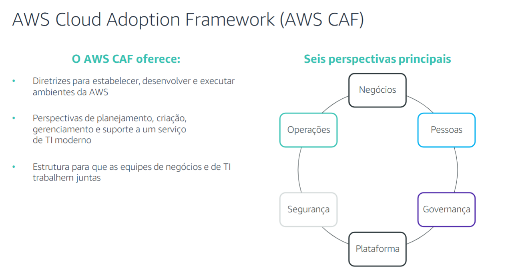

#  Amazon Web Services (AWS) 

A **AWS (Amazon Web Services)** é uma plataforma de computação em nuvem que oferece uma ampla gama de serviços, incluindo **armazenamento, banco de dados, rede, computação e muito mais**. Esses serviços permitem que empresas e desenvolvedores criem soluções escaláveis, seguras e eficientes.

---

## 🌐 Modelos de Serviços em Nuvem

A AWS oferece **três modelos principais** de serviços de nuvem:

| Modelo                                 | Definição                                                                                   |
| -------------------------------------- | ------------------------------------------------------------------------------------------- |
| **IaaS (Infraestrutura como Serviço)** | Você gerencia servidores e sistemas operacionais, enquanto a AWS fornece hardware e redes.  |
| **PaaS (Plataforma como Serviço)**     | A AWS gerencia toda a infraestrutura, e você foca apenas no desenvolvimento de aplicativos. |
| **SaaS (Software como Serviço)**       | A AWS gerencia tudo, e você apenas usa o software, como no Facebook e Dropbox.              |

---

## 💡 Infraestrutura no Local vs. AWS

A AWS fornece os mesmos recursos de um **data center tradicional**, mas de forma escalável e gerenciada na nuvem.

> _"Quase tudo o que você faz em um data center pode ser feito na AWS."_

---

## ⚡ O que são Serviços Web?

✅ Qualquer parte do software disponibilizada via Internet.  
✅ Usa **XML ou JSON** para comunicação via API.  
✅ Funciona de forma independente do sistema operacional e linguagem de programação.

---

## 🚀 Serviços da AWS

A AWS oferece diversos serviços para ajudar empresas a **escalar e crescer**, fornecendo recursos de **computação, armazenamento, rede, banco de dados e mais**.

### Exemplos de Serviços AWS:

| Categoria          | Serviço                                        |
| ------------------ | ---------------------------------------------- |
| **Computação**     | Amazon EC2, AWS Lambda, AWS Batch              |
| **Armazenamento**  | Amazon S3, Amazon EBS, Amazon Glacier          |
| **Banco de Dados** | Amazon RDS, Amazon DynamoDB, Amazon Redshift   |
| **Rede**           | Amazon VPC, AWS CloudFront, AWS Direct Connect |
| **Segurança**      | AWS Shield, AWS WAF, AWS IAM                   |

> 💡 Exemplo: Um aplicativo de banco de dados pode usar **Amazon EC2** para computação, **Amazon S3** para armazenamento e **Amazon DynamoDB** para indexação.

---

## 🎯 Como Escolher um Serviço AWS?

| Caso de Uso                              | Serviço Recomendado                 |
| ---------------------------------------- | ----------------------------------- |
| Controle total dos recursos              | Amazon EC2                          |
| Executar código sem gerenciar servidores | AWS Lambda                          |
| Aplicações web gerenciadas               | AWS Elastic Beanstalk               |
| Plataforma leve para aplicativos web     | Amazon Lightsail                    |
| Execução de cargas de trabalho em lote   | AWS Batch                           |
| Infraestrutura AWS no local              | AWS Outposts                        |
| Microsserviços e contêineres             | Amazon ECS, Amazon EKS, AWS Fargate |
| Migração de virtualização                | VMware Cloud on AWS                 |

---

## 🛠️ Três Maneiras de Interagir com a AWS

Você pode gerenciar seus serviços AWS das seguintes formas:

1. **Console de Gerenciamento AWS** 📊 - Interface gráfica completa.
2. **AWS CLI** 🖥️ - Linha de comando para scripts e automação.
3. **SDKs AWS** 📦 - Pacotes para integração em diversas linguagens de programação.

---

## 📌 AWS Cloud Adoption Framework (AWS CAF)

O **AWS CAF** auxilia na **migração para a nuvem**, dividindo o processo em **perspectivas**:

- **Negócios, Pessoas e Governança** → Foco no negócio 📈
- **Plataforma, Segurança e Operações** → Foco técnico 🔒

---

## 📖 Documentação AWS

A **AWS oferece documentação abrangente** para todos os serviços, incluindo:

📚 **Guias de Uso e APIs**  
🛠️ **Tutoriais e Casos de Uso**  
🎓 **Treinamentos e Certificações**

Acesse a [Documentação Oficial da AWS](https://docs.aws.amazon.com) para mais informações! 🚀
